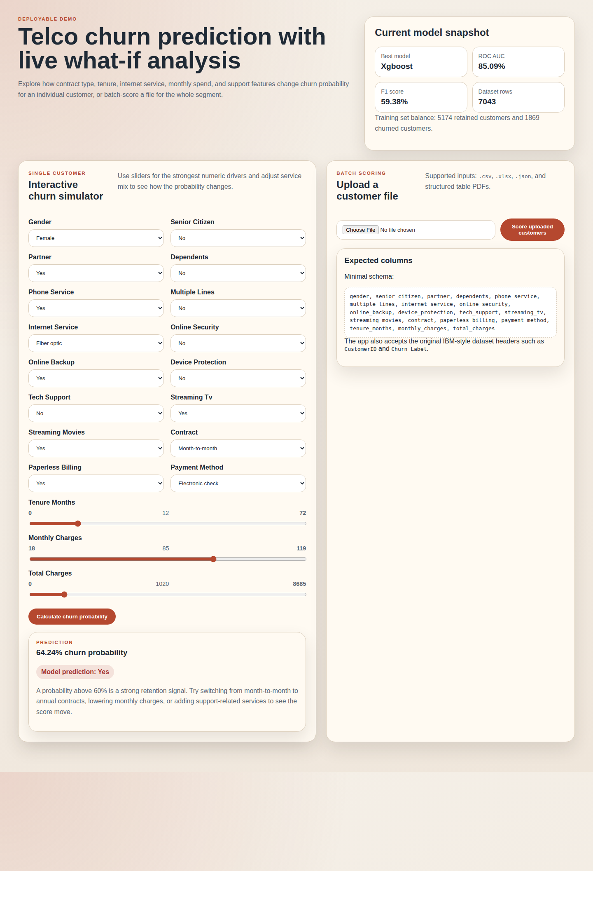

# Telco Customer Churn Predictor

Flask application for exploring and scoring customer churn risk using a cleaned telco dataset and an XGBoost-based classification pipeline.



Live demo: https://telco-churn-predictor.vercel.app

## Overview

Customer churn is a practical retention problem for subscription businesses. This project predicts churn risk from customer demographics, contract details, service usage, and billing history, then exposes the model through a web application.

The repository includes:

- a reproducible training workflow
- an interactive single-customer simulator
- batch scoring for uploaded files
- a deployed web app

## Application Features

### Interactive churn simulator

The web app includes a form-based simulator for testing how churn probability changes when customer attributes are adjusted. The interface supports:

- service and billing selections for categorical features
- sliders for `tenure_months`, `monthly_charges`, and `total_charges`
- probability output and predicted churn label for a single customer profile

### Batch scoring

The app can also score customer records in bulk. Supported upload formats:

- `csv`
- `xlsx`
- `json`
- `pdf` containing a structured table close to the expected schema

For each record, the output includes:

- `customerid`
- `churn_probability`
- `predicted_churn`

## Dataset And Features

The source dataset is stored in [Telco_customer_churn.xlsx](Telco_customer_churn.xlsx).

The deployed model uses these input features:

- `gender`
- `senior_citizen`
- `partner`
- `dependents`
- `phone_service`
- `multiple_lines`
- `internet_service`
- `online_security`
- `online_backup`
- `device_protection`
- `tech_support`
- `streaming_tv`
- `streaming_movies`
- `contract`
- `paperless_billing`
- `payment_method`
- `tenure_months`
- `monthly_charges`
- `total_charges`

The dataset does not include a true `age` field. The closest related variable is `senior_citizen`, which is why the app uses that field instead.

## Modeling Approach

Three models are trained and compared in the current workflow:

- Logistic Regression
- Random Forest
- XGBoost

The training flow uses:

- train/test split before evaluation
- median imputation for numeric fields
- most-frequent imputation for categorical fields
- one-hot encoding for categorical variables

The deployed model is XGBoost. For production hosting on Vercel, the trained model is exported to ONNX so inference can run in a smaller runtime environment while preserving the learned model behavior.

## Validation Results

Current local validation metrics for the deployed XGBoost model:

- ROC AUC: `85.14%`
- Average Precision: `66.70%`
- Accuracy: `80.20%`
- Precision: `64.62%`
- Recall: `56.15%`
- F1: `60.09%`

Comparison metrics for the other evaluated models are stored in [artifacts/metrics.json](artifacts/metrics.json).

## Example Outcomes

Local testing showed the app responds sensibly to changes in tenure, contract type, monthly spend, internet service, and support features.

Examples observed during validation:

- month-to-month, short-tenure, fiber customer with limited support services: `64.24%` churn probability
- short-tenure senior customer with fiber service and no support add-ons: `91.26%` churn probability
- long-tenure customer on a two-year contract with lower charges and automatic payments: `0.20%` churn probability

## Repository Structure

```text
Teleco-Customer-Churn-Prediction/
├── app.py
├── modeling.py
├── train_model.py
├── wsgi.py
├── requirements.txt
├── requirements-dev.txt
├── artifacts/
│   ├── metrics.json
│   ├── model_metadata.json
│   └── xgboost_model.onnx
├── assets/
│   └── app-screenshot.png
├── static/
│   └── styles.css
├── templates/
│   └── index.html
└── Telco_customer_churn.xlsx
```

## Run Locally

```bash
pip install -r requirements-dev.txt
python train_model.py
pip install -r requirements.txt
python app.py
```

Then open:

```text
http://localhost:5000
```

Health check:

```text
http://localhost:5000/health
```

## Deployment

### Vercel

Live app:

- https://telco-churn-predictor.vercel.app

The deployment uses the exported ONNX artifact to keep the runtime lightweight.

### Render

The repository also includes [render.yaml](render.yaml) for deployment on Render.

## Limitations

- the dataset is static rather than a live production feed
- PDF parsing is best-effort and depends on the source file having a usable table
- the app does not currently expose feature-level explanations such as SHAP values
- the prediction threshold uses the default classification cutoff
- production concerns such as authentication, monitoring, and audit logging are outside the current scope

## Next Improvements

1. Add feature-level explanation for individual predictions.
2. Support threshold tuning based on business cost tradeoffs.
3. Add downloadable sample input templates.
4. Add automated tests for preprocessing, uploads, and prediction routes.
